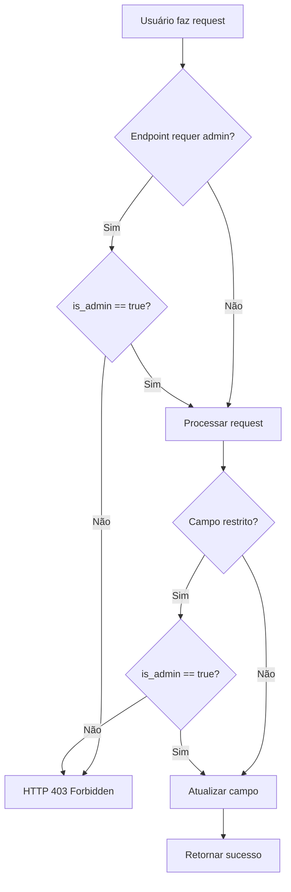

# 🔐 Controle de Acesso Baseado em Funções (RBAC) - Settings

## 📋 Visão Geral

Este documento descreve a implementação do controle de acesso baseado em funções para o módulo de configurações do **APIRagFST**.

**Regra Principal**: Usuários não-administradores podem alterar **APENAS o tema** da interface.

---

## 🎯 Matriz de Permissões

| Configuração | Admin | Usuário Regular |
|-------------|-------|-----------------|
| **System Prompt** | ✅ Editar | ❌ Oculto |
| **Nome do Sistema** | ✅ Editar | ❌ Oculto |
| **Descrição do Sistema** | ✅ Editar | ❌ Oculto |
| **Logo do Sistema** | ✅ Editar | ❌ Oculto |
| **Idioma** | ✅ Editar | ❌ Oculto |
| **Tema** | ✅ Editar | ✅ **Editar** |
| **Notificações** | ✅ Editar | ❌ Oculto |
| **Auto-save** | ✅ Editar | ❌ Oculto |
| **Restaurar Padrões** | ✅ Permitido | ❌ Bloqueado |

---

## 🛡️ Implementação de Segurança

### Backend (API)

#### 1. **System Prompt** - Apenas Admin

**Endpoints Protegidos:**
- `PUT /api/v1/settings/system-prompt`
- `POST /api/v1/settings/reset-system-prompt`

**Código:**
```python
# backend/app/api/v1/settings.py (linhas 61-66)
is_admin = current_user.get('is_admin', False)

if not is_admin:
    raise HTTPException(
        status_code=403,
        detail="Apenas administradores podem alterar o system prompt"
    )
```

#### 2. **Configurações Gerais** - Tema Only para Usuários

**Endpoint:** `PUT /api/v1/settings/general`

**Código:**
```python
# backend/app/api/v1/settings.py (linhas 283-292)
if not is_admin:
    allowed_fields = ['theme']
    for field in update_data.keys():
        if field not in allowed_fields:
            raise HTTPException(
                status_code=403,
                detail="Usuários não-administradores podem alterar apenas o tema"
            )
```

#### 3. **Restaurar Configurações** - Apenas Admin

**Endpoint:** `POST /api/v1/settings/reset-general`

**Código:**
```python
# backend/app/api/v1/settings.py (linhas 337-342)
if not is_admin:
    raise HTTPException(
        status_code=403,
        detail="Apenas administradores podem restaurar configurações padrão"
    )
```

---

### Frontend (UI)

#### 1. **Conditional Rendering**

**System Prompt:**
```tsx
{/* components/Settings.tsx (linhas 310-353) */}
{isAdmin && (
    <div className="bg-white rounded-xl shadow-md border border-slate-200 p-6 mb-6">
        {/* System Prompt Editor */}
    </div>
)}
```

**Configurações de Sistema:**
```tsx
{/* components/Settings.tsx (linhas 369-414) */}
{isAdmin && (
    <>
        <div>{/* Nome do Sistema */}</div>
        <div>{/* Descrição do Sistema */}</div>
        <div>{/* Logo do Sistema */}</div>
    </>
)}
```

**Idioma, Notificações, Auto-save:**
```tsx
{/* components/Settings.tsx (linhas 427-494) */}
{isAdmin && (
    <>
        <div>{/* Idioma */}</div>
        <div>{/* Notificações */}</div>
        <div>{/* Auto-save */}</div>
    </>
)}
```

#### 2. **User Experience**

**Badge para Usuários Regulares:**
```tsx
{/* components/Settings.tsx (linhas 417-426) */}
{!isAdmin && (
    <div className="mb-4 p-3 bg-blue-50 border border-blue-200 rounded-lg">
        <p className="text-sm text-blue-800 font-medium">
            👤 Configuração de Usuário
        </p>
        <p className="text-xs text-blue-600 mt-1">
            Você pode personalizar apenas o tema da interface.
            Outras configurações são gerenciadas pelo administrador.
        </p>
    </div>
)}
```

**Botão Dinâmico:**
```tsx
{/* components/Settings.tsx (linha 520) */}
{generalSettingsSaveStatus === 'idle' && (isAdmin ? 'Salvar' : 'Salvar Tema')}
```

---

## 🧪 Cenários de Teste

### Cenário 1: Usuário Regular Acessa Settings

**Entrada:** Usuário com `is_admin: false` acessa `/settings`

**Resultado Esperado:**
- ✅ Vê seção "Configuração de Usuário" com badge azul
- ✅ Vê apenas campo "Tema" editável
- ✅ Botão exibe "Salvar Tema"
- ❌ NÃO vê: System Prompt, Nome/Descrição/Logo, Idioma, Notificações, Auto-save
- ❌ NÃO vê botão "Restaurar Padrões"

**Frontend:**
```
┌─────────────────────────────────────┐
│ Configurações de API (readonly)    │
├─────────────────────────────────────┤
│ Parâmetros do Modelo (readonly)    │
├─────────────────────────────────────┤
│ 👤 Configuração de Usuário          │
│ ℹ️ Apenas tema editável             │
│                                     │
│ Tema: [Dropdown ▼]                  │
│                    [Salvar Tema] ─→ │
└─────────────────────────────────────┘
```

### Cenário 2: Administrador Acessa Settings

**Entrada:** Usuário com `is_admin: true` acessa `/settings`

**Resultado Esperado:**
- ✅ Vê TODAS as configurações
- ✅ Pode editar System Prompt
- ✅ Pode editar Nome/Descrição/Logo
- ✅ Pode editar Idioma, Tema, Notificações, Auto-save
- ✅ Vê botões "Restaurar Padrões" e "Salvar"

**Frontend:**
```
┌─────────────────────────────────────┐
│ Configurações de API (readonly)    │
├─────────────────────────────────────┤
│ Parâmetros do Modelo (readonly)    │
├─────────────────────────────────────┤
│ System Prompt do RAG                │
│ [Textarea editável...]              │
│ [Restaurar] [Salvar Configurações]─→│
├─────────────────────────────────────┤
│ 🔐 Configurações de Sistema (Admin) │
│ Nome: [Input]                       │
│ Descrição: [Input]                  │
│ Logo: [Input]                       │
├─────────────────────────────────────┤
│ Idioma: [Dropdown]                  │
│ Tema: [Dropdown]                    │
│ Notificações: [Toggle]              │
│ Auto-save: [Toggle]                 │
│ [Restaurar Padrões]     [Salvar] ─→ │
└─────────────────────────────────────┘
```

### Cenário 3: Usuário Regular Tenta Alterar via API

**Entrada:** POST para `/api/v1/settings/general` com `{language: "en-US"}`

**Resultado:**
```json
{
  "detail": "Usuários não-administradores podem alterar apenas o tema"
}
```
**Status Code:** `403 Forbidden`

### Cenário 4: Usuário Regular Tenta Editar System Prompt

**Entrada:** PUT para `/api/v1/settings/system-prompt`

**Resultado:**
```json
{
  "detail": "Apenas administradores podem alterar o system prompt"
}
```
**Status Code:** `403 Forbidden`

---

## 📊 Fluxo de Validação



---

## 🔍 Checklist de Validação

### Backend
- [x] System Prompt: validação de admin em update
- [x] System Prompt: validação de admin em reset
- [x] Configurações Gerais: apenas 'theme' para não-admin
- [x] Reset Geral: validação de admin
- [x] Mensagens de erro claras (403 Forbidden)

### Frontend
- [x] System Prompt oculto para não-admin
- [x] Configurações de Sistema ocultas para não-admin
- [x] Idioma oculto para não-admin
- [x] Notificações ocultas para não-admin
- [x] Auto-save oculto para não-admin
- [x] Botão "Restaurar Padrões" oculto para não-admin
- [x] Badge informativo para usuários regulares
- [x] Texto do botão dinâmico ("Salvar Tema" vs "Salvar")

### Segurança
- [x] Validação no backend (defense in depth)
- [x] JWT token usado para identificar admin
- [x] Campos restritos não podem ser alterados via API
- [x] UI oculta opções não disponíveis

---

## 📝 Arquivos Modificados

### Backend
- `backend/app/api/v1/settings.py`
  - Linhas 61-66: Validação admin em `update_system_prompt`
  - Linhas 108-112: Validação admin em `reset_system_prompt`
  - Linhas 283-292: Restrição de campos para não-admin
  - Linhas 337-342: Validação admin em `reset_general_settings`

### Frontend
- `components/Settings.tsx`
  - Linhas 310-353: Conditional rendering do System Prompt
  - Linhas 369-414: Conditional rendering das configurações de sistema
  - Linhas 417-426: Badge informativo para não-admin
  - Linhas 427-441: Idioma apenas para admin
  - Linhas 455-494: Notificações/Auto-save apenas para admin
  - Linhas 497-505: Botão "Restaurar Padrões" apenas para admin
  - Linha 520: Texto do botão dinâmico
  - Linhas 526-552: Botões do System Prompt apenas para admin

---

## 🚀 Como Testar

### 1. Criar Usuários de Teste

```sql
-- Admin
INSERT INTO users (id, email, password_hash, is_admin)
VALUES ('admin-uuid', 'admin@test.com', 'hash', true);

-- Usuário Regular
INSERT INTO users (id, email, password_hash, is_admin)
VALUES ('user-uuid', 'user@test.com', 'hash', false);
```

### 2. Testar via UI

1. Login como usuário regular
2. Acessar `/settings`
3. Verificar que apenas "Tema" está visível
4. Tentar salvar mudança de tema ✅
5. Logout
6. Login como admin
7. Acessar `/settings`
8. Verificar que TODAS as configurações estão visíveis
9. Editar e salvar configurações ✅

### 3. Testar via API

```bash
# Usuário Regular tentando alterar idioma (deve falhar)
curl -X PUT http://localhost:8000/api/v1/settings/general \
  -H "Authorization: Bearer <token-usuario>" \
  -H "Content-Type: application/json" \
  -d '{"language": "en-US"}'
# Esperado: 403 Forbidden

# Usuário Regular alterando tema (deve funcionar)
curl -X PUT http://localhost:8000/api/v1/settings/general \
  -H "Authorization: Bearer <token-usuario>" \
  -H "Content-Type: application/json" \
  -d '{"theme": "dark"}'
# Esperado: 200 OK

# Admin alterando qualquer campo (deve funcionar)
curl -X PUT http://localhost:8000/api/v1/settings/general \
  -H "Authorization: Bearer <token-admin>" \
  -H "Content-Type: application/json" \
  -d '{"language": "en-US", "theme": "dark"}'
# Esperado: 200 OK
```

---

## 📚 Referências

- Commit: `fcc5af3` - feat: implement strict role-based access control for settings
- Branch: `feature/store-access-control`
- Data: 2025-11-26

---

## ✅ Status da Implementação

- **Backend**: ✅ Completo
- **Frontend**: ✅ Completo
- **Testes**: ⏳ Pendente (manual)
- **Documentação**: ✅ Completo
- **Code Review**: ⏳ Pendente
